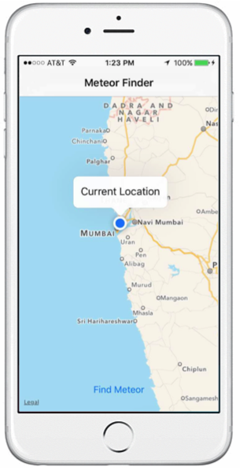
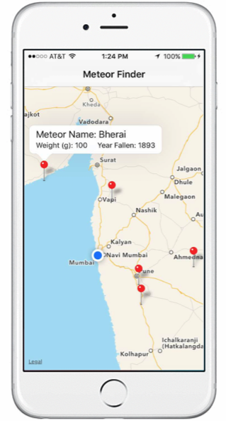

MeteoriteFinder
==========================
 

MeteoriteFinder is an iOS application that utilizes the NASA API Endpoint for Meteorite Landings to display the closest meteors to your current location.  It also provides information on each meteor such as: Name, Mass, and Year Fallen.  

Built during NASA SpaceApps 2016 @ Pasadena
Ammar Rizvi (Front-End), John Stuart(Back-End), Raymond Farias(Lead)
[Slides](https://docs.google.com/presentation/d/1dOflrA0t5QLxGKJMWWEFlvzasv3m7sDILfMcjQBkbwk/edit?usp=sharing)

## Requirements

* XCode 7.3 (or higher)
* iOS 9 SDK (or higher)

## Instructions

1. Get the code in this repository.
2. Double-click the  ```MeteorFinder.xcworkspace``` file.
3. Choose a Target and Device/Simulator combination from the Scheme menu and hit Run to run the application. 
4. Play around with different locations by clicking Debug -> Simulate Location
5. Play around with number of meteors to display by changing the ```numberOfMeteorsToFind``` constant at the top of  ```ViewController.swift``` 

## Issues

There are no known bugs.  However, if you decide to change the number of meteors to find, note that very large numbers can drastically reduce performance.

## Licensing

Licensed under the Apache License, Version 2.0 (the "License");
you may not use this file except in compliance with the License.
You may obtain a copy of the License at

   http://www.apache.org/licenses/LICENSE-2.0

Unless required by applicable law or agreed to in writing, software
distributed under the License is distributed on an "AS IS" BASIS,
WITHOUT WARRANTIES OR CONDITIONS OF ANY KIND, either express or implied.
See the License for the specific language governing permissions and
limitations under the License.

A copy of the license is available in the repository's [LICENSE](https://github.com/jaystu/MeteorFinder/blob/master/LICENSE) file.
